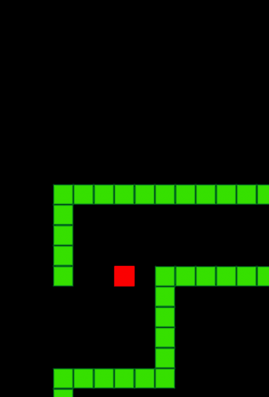

<h1 align="center">
  <a href="https://fontmeme.com/fonts/space-cadets-font/"></a>
</h1>

<h1 align="center">
  
</h1> 


## 🤖️ Tecnologias utilizadas

O projeto foi desenvolvido utilizando as seguintes tecnologias:

- [JavaScript](https://developer.mozilla.org/pt-BR/docs/Aprender/JavaScript)

---

## 📦️ Como baixar o projeto
```bash

  # Clonar o repositório
  $ git clone https://github.com/thiagoasb/snake-game

  # Entrar no diretório
  $ cd snake-gmae

  # Dois cliques no arquivo para abrir no navegagor
```
